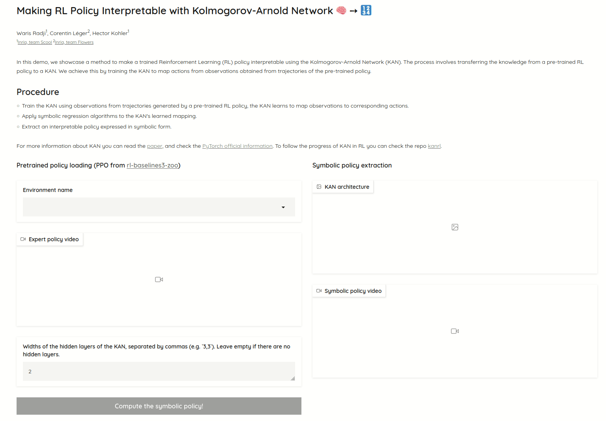

Check out the configuration reference at https://huggingface.co/docs/hub/spaces-config-reference

### Application demo : 

- Choose a RL environment from the gymnasium library. A policy from a pre-trained Proximal Policy Optimization (PPO) agent will automatically be loaded, which generates an expert dataset and videos of the agent's performance in the selected environment.
- Click the "Compute Symbolic Policy" button to train a KAN policy on the expert dataset. Once it is done, you can visualize the KAN network and watch videos of the KAN agent's performance in the selected environment !

